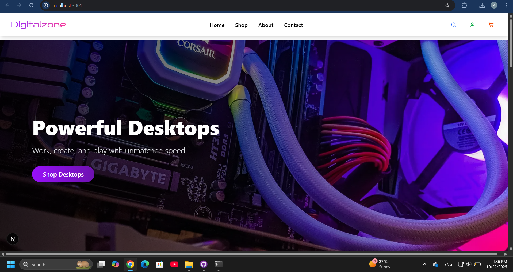
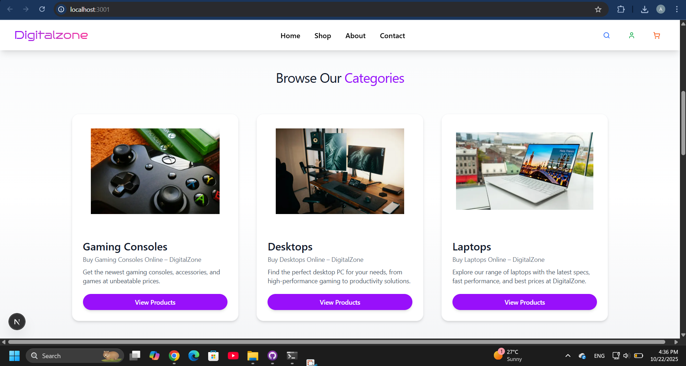
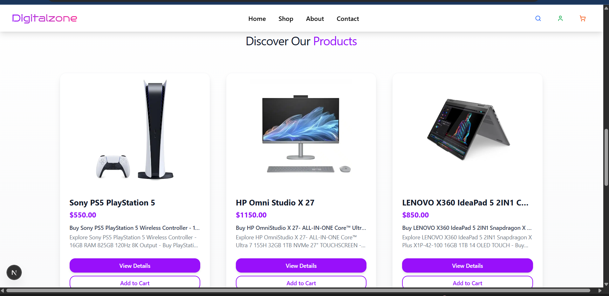
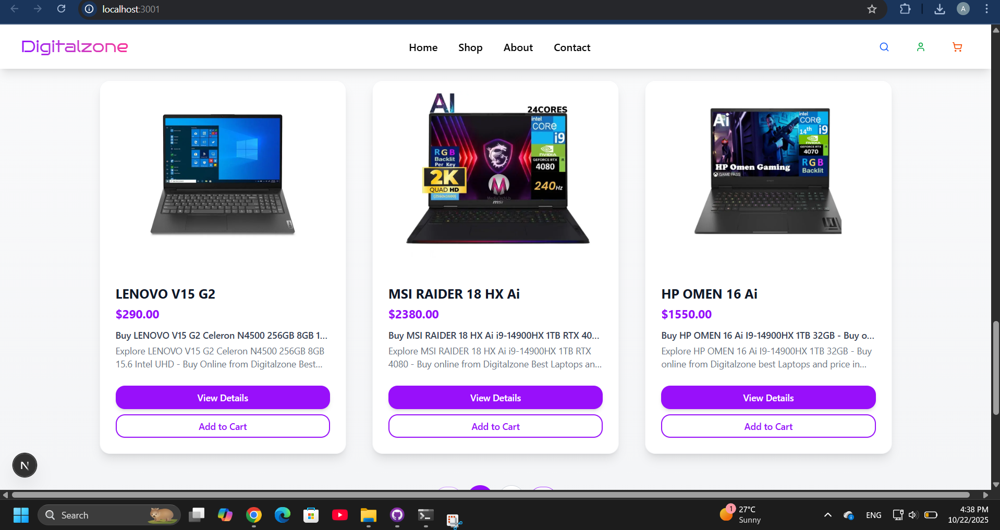
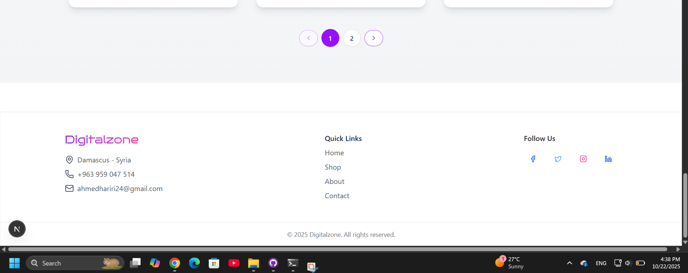
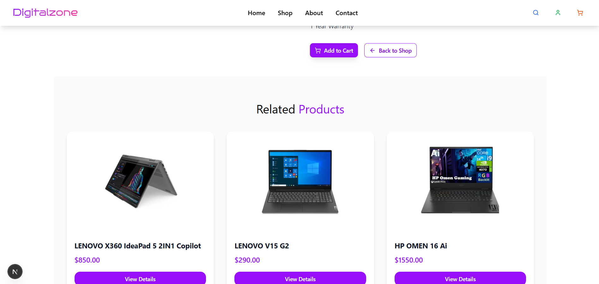
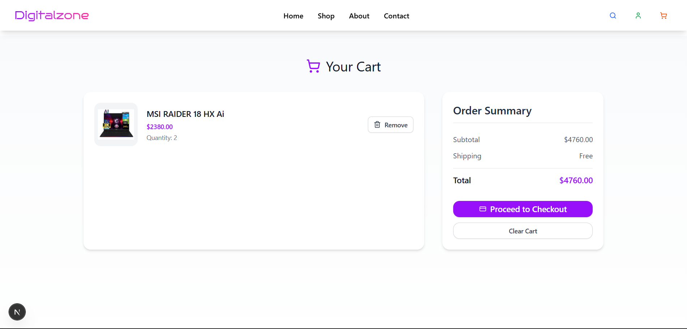
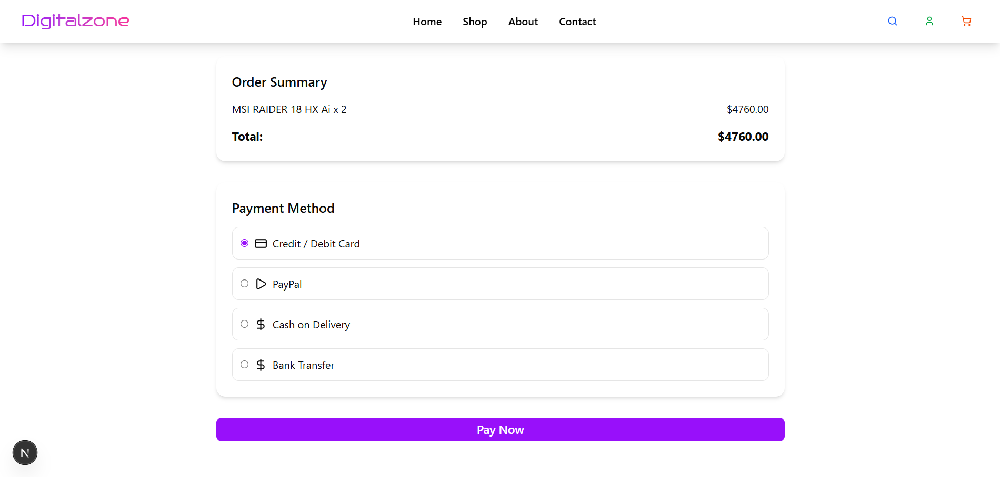

# 🛍️ DigitalZone — Modern E-Commerce Website

**DigitalZone** is a modern, fully responsive e-commerce front-end built with Next.js, Tailwind CSS and TypeScript.
It is SEO-friendly and includes pages like Home, Product Details, Cart, Checkout, and more.

---

## 🚀 Quick Overview
- **SEO optimized**: friendly slugs, meta titles & meta descriptions.
- **Pages included**: Home, Product Details, Cart, Checkout, Admin Dashboard.
- **Features**: responsive design, product gallery, related products, cart persistence.

---

## 🖼️ Screenshots

<p align="center">
  
</p>

<p align="center">
  
</p>

<p align="center">
  
</p>

<p align="center">
  
</p>

<p align="center">
  
</p>

<p align="center">
  
</p>

<p align="center">
  
</p>

<p align="center">
  
</p>

<p align="center">
  
</p>

---

## 🔧 Run Locally

```bash
# install dependencies
npm install

# run dev server
npm run dev
